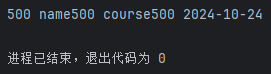
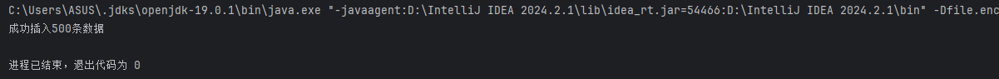
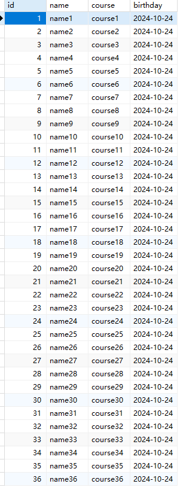
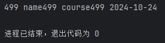

# 《JDBC技术操作练习》


##### 学院：省级示范性软件学院


##### 题目：《JDBC技术操作练习》


##### 姓名：王承宸


##### 学号：2100a60134


##### 班级：软工2202


##### 日期：2024-10-24


## 一、完成teacher的CRUD练习，提供CRUD的代码。

### 1、查询

#### 代码如下：

```java
package org.example.jdbcdemo1;

import java.sql.*;

public class jdbcTest1{
    public static void main(String[] args) throws SQLException {
        //建立与数据库的连接
        String url = "jdbc:mysql://localhost:3306/jdbc实验";
        String user = "root";
        String password = "chengchen@1";
        String sql = "select * from teacher where id = 500";

        Connection conn = null;
        PreparedStatement ps = null;
        ResultSet rs = null;

        try {
            conn = DriverManager.getConnection(url,user,password);
        } catch (SQLException e) {
            throw new RuntimeException(e);
        }

        try {
            ps = conn.prepareStatement(sql);
        } catch (SQLException e) {
            throw new RuntimeException(e);
        }

        try {
            rs = ps.executeQuery(sql);//接收本次查询的结果
            while (rs.next()) {
                System.out.println(rs.getObject(1) + " " + rs.getObject(2) + " " + rs.getObject(3)+ " " + rs.getObject(4));
            }
        } catch (SQLException e) {
            throw new RuntimeException(e);
        }
        finally{//关闭与数据库的连接，先创建的后关闭
            rs.close();
            ps.close();
            conn.close();
        }

    }
}
```

#### 返回结果如下：



### 2、插入

#### 代码如下：

```java
package org.example.jdbcdemo1;

import java.sql.*;

public class jdbcTest2 {
    public static void main(String[] args) throws SQLException {

        //建立与数据库的联系
        String url = "jdbc:mysql://localhost:3306/jdbc实验";
        String user = "root";
        String password = "chengchen@1";
        String sql = "insert into teacher(id,name,course,birthday) values(?,?,?,?)";

        Connection conn = null;
        PreparedStatement ps = null;

        try {
            conn = DriverManager.getConnection(url,user,password);
            conn.setAutoCommit(false);//将自动提交设置为false，即需要手动提交
        } catch (SQLException e) {
            throw new RuntimeException(e);
        }

        try {
            ps = conn.prepareStatement(sql);

            //设置参数
            ps.setInt(1,501);
            ps.setString(2,"name501");
            ps.setString(3,"course501");
            ps.setDate(4,new java.sql.Date(System.currentTimeMillis()));

            ps.executeUpdate();//执行本次插入操作
            conn.commit();//提交
        } catch (SQLException e) {
            throw new RuntimeException(e);
        }finally {//关闭与数据库的连接，先创建的后关闭
            ps.close();
            conn.close();
        }
    }
}
```

#### 数据库显示如下：


### 3、更新

### 代码如下：

```java
package org.example.jdbcdemo1;

import java.sql.*;

public class jdbcTest3 {
    public static void main(String[] args) throws SQLException {

        //建立与数据库的联系
        String url = "jdbc:mysql://localhost:3306/jdbc实验";
        String user = "root";
        String password = "chengchen@1";
        String sql = "update teacher set name = ? where id = 501";

        Connection conn = null;
        PreparedStatement ps = null;

        try {
            conn = DriverManager.getConnection(url,user,password);
            conn.setAutoCommit(false);//将自动提交设置为false，即需要手动提交
        } catch (SQLException e) {
            throw new RuntimeException(e);
        }

        try {
            ps = conn.prepareStatement(sql);
            //设置参数
            ps.setString(1,"cc");
            
            ps.executeUpdate();//执行本次更新操作
            conn.commit();//提交
        } catch (SQLException e) {
            throw new RuntimeException(e);
        }finally {//关闭与数据库的连接，先创建的后关闭
            ps.close();
            conn.close();
        }
    }
}
```

### 数据库显示如下：


### 4、删除

#### 代码如下：

```java
package org.example.jdbcdemo1;

import java.sql.*;

public class jdbcTest4 {
    public static void main(String[] args) throws SQLException {

        //建立与数据库的联系
        String url = "jdbc:mysql://localhost:3306/jdbc实验";
        String user = "root";
        String password = "chengchen@1";
        String sql = "delete from teacher where id = ?";

        Connection conn = null;
        PreparedStatement ps = null;

        try {
            conn = DriverManager.getConnection(url,user,password);
            conn.setAutoCommit(false);//将自动提交设置为false，即需要手动提交
        } catch (SQLException e) {
            throw new RuntimeException(e);
        }

        try {
            ps = conn.prepareStatement(sql);
            //设置参数
            ps.setInt(1,501);

            ps.executeUpdate();//执行本次删除操作
            conn.commit();//提交
        } catch (SQLException e) {
            conn.rollback();//如果发生错误就回滚
            throw new RuntimeException(e);
        }finally {//关闭与数据库的连接，先创建的后关闭
            ps.close();
            conn.close();
        }
    }
}
```

#### 数据库显示：


#### 可以看到已经成功删除了id为501的数据

## 二、完成teacher表的批量插入练习，插入500个教师，每插入100条数据提交一次。

### 代码如下：

```java
package org.example.jdbcdemo1;

import java.sql.*;

public class jdbcTest5 {
    public static void main(String[] args) {
        String url = "jdbc:mysql://localhost:3306/jdbc实验";
        String user = "root";
        String password = "chengchen@1";
        String sql = "Insert into teacher(id,name,course,birthday) values(?,?,?,?)";

        Connection conn = null;
        PreparedStatement ps = null;

        try {
            conn = DriverManager.getConnection(url,user,password);
            {
                conn.setAutoCommit(false);
                try {
                    ps = conn.prepareStatement(sql);

                    //开始设置参数，来控制需要插入多少数据
                    for (int i = 1; i <= 500; i++) {
                        ps.setInt(1, i);
                        ps.setString(2, "name" + i);
                        ps.setString(3, "course" + i);
                        ps.setDate(4, new java.sql.Date(System.currentTimeMillis()));
                        //添加到批处理
                        ps.addBatch();
                        if (i % 100 == 0) {
                            ps.executeBatch();
                            ps.clearBatch();
                        }
                    }
                    ps.executeBatch();
                    conn.commit();
                    System.out.println("成功插入500条数据");
                } catch (SQLException e) {
                    conn.rollback();
                    e.printStackTrace();
                }
            }
        } catch (SQLException e) {
            e.printStackTrace();
        }finally {
            if(ps != null){
                try {
                    ps.close();
                } catch (SQLException e) {
                    throw new RuntimeException(e);
                }
            }
            if(conn != null){
                try {
                    conn.close();
                } catch (SQLException e) {
                    throw new RuntimeException(e);
                }
            }
        }
    }
}
```

### 终端返回：



### 数据库显示：



### 共500条，后略。

## 三、完成可滚动的结果集练习，只查看结果集中倒数第2条数据。

### 代码如下：

```java
package org.example.jdbcdemo1;

import java.sql.*;

public class jdbcTest6{
    public static void main(String[] args) throws SQLException {
        //建立与数据库的连接
        String url = "jdbc:mysql://localhost:3306/jdbc实验";
        String user = "root";
        String password = "chengchen@1";
        String sql = "select * from teacher";

        Connection conn = null;
        PreparedStatement ps = null;
        ResultSet rs = null;

        try {
            conn = DriverManager.getConnection(url,user,password);
        } catch (SQLException e) {
            throw new RuntimeException(e);
        }

        try {//默认情况下，ResultSet是只向前的，不可滚动的，指定结果集类型 ResultSet.TYPE_SCROLL_INSENSITIVE，ResultSet.CONCUR_READ_ONLY来实现滚动
            ps = conn.prepareStatement(sql,ResultSet.TYPE_SCROLL_INSENSITIVE, ResultSet.CONCUR_READ_ONLY);
        } catch (SQLException e) {
            throw new RuntimeException(e);
        }

        try {
            rs = ps.executeQuery(sql);
            rs.absolute(-2);
            System.out.println(rs.getObject(1) + " " + rs.getObject(2) + " " + rs.getObject(3)+ " " + rs.getObject(4));
        } catch (SQLException e) {
            throw new RuntimeException(e);
        }
        finally{
            rs.close();
            ps.close();
            conn.close();
        }

    }
}
```

### 返回结果如下：

