### 员工信息练习题

##### 1.查询所有员工的姓名、邮箱和工作岗位。

```mysql
SELECT first_name,last_name,email,job_title
FROM employees
```


##### 2.查询所有部门的名称和位置。

```mysql
SELECT dept_name,location
FROM departments
```

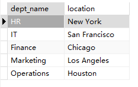

##### 3. 查询工资超过70000的员工姓名和工资。

``` mysql
SELECT first_name,last_name,salary
FROM employees
WHERE salary > 70000
```

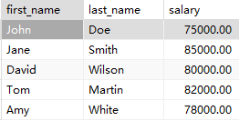

##### 4. 查询IT部门的所有员工。

```mysql
SELECT first_name,last_name
FROM employees
NATURAL JOIN departments
WHERE dept_name = 'IT'
```


##### 5. 查询入职日期在2020年之后的员工信息。

```mysql
SELECT *
FROM employees
WHERE hire_date > '2019-12-31'
```

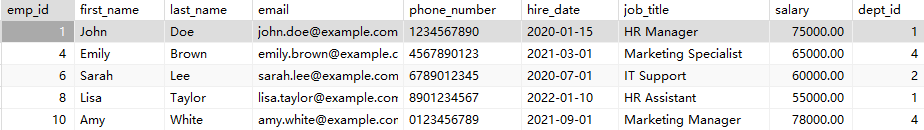

##### 6. 计算每个部门的平均工资。

```mysql
SELECT dept_name,AVG(salary)
FROM employees
NATURAL JOIN departments
GROUP BY dept_id
```

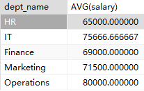

##### 7. 查询工资最高的前3名员工信息。

```mysql
SELECT *
FROM employees
ORDER BY salary DESC
LIMIT 3
```

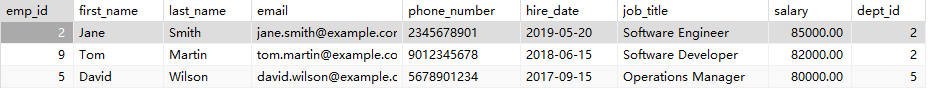

##### 8. 查询每个部门员工数量。

```mysql
SELECT dept_name,COUNT(*)
FROM employees
NATURAL JOIN departments
GROUP BY dept_id
```


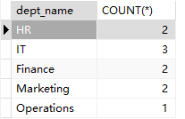

##### 9. 查询没有分配部门的员工。

```mysql
SELECT first_name,last_name
FROM employees
WHERE dept_id IS NULL
```


##### 10. 查询参与项目数量最多的员工。

```mysql
SELECT first_name,last_name,COUNT(*)
FROM employees
NATURAL JOIN employee_projects
GROUP BY emp_id
HAVING COUNT(*) = (
	SELECT COUNT(*)
	FROM employees
	NATURAL JOIN employee_projects
	GROUP BY emp_id
	ORDER BY COUNT(*) DESC
	LIMIT 1
)
```

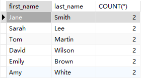

##### 11. 计算所有员工的工资总和。

```mysql
SELECT SUM(salary)
FROM employees
```

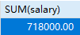

##### 12. 查询姓"Smith"的员工信息。

```mysql
SELECT *
FROM employees
WHERE last_name = 'Smith'
```

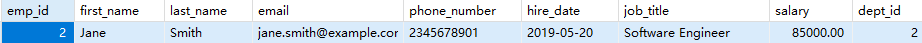

##### 13. 查询即将在半年内到期的项目。

```mysql
SELECT project_name
FROM projects
WHERE DATEDIFF(end_date,start_date) < 188
```


##### 14. 查询至少参与了两个项目的员工。

```mysql
SELECT CONCAT(first_name," ",last_name) employee
FROM employees
NATURAL JOIN employee_projects
GROUP BY emp_id
HAVING COUNT(project_id) >= 2
```


##### 15. 查询没有参与任何项目的员工。

```mysql
SELECT CONCAT(first_name," ",last_name) employee
FROM employees
WHERE emp_id NOT IN (
		SELECT DISTINCT emp_id
		FROM employee_projects
)
```


##### 16. 计算每个项目参与的员工数量。

```mysql
SELECT project_name,COUNT(*) participant
FROM employee_projects
NATURAL JOIN projects
GROUP BY project_id
```


##### 17. 查询工资第二高的员工信息。

```mysql
SELECT *
FROM employees
WHERE salary = (
		SELECT salary
		FROM employees
		WHERE salary < (
				SELECT salary
				FROM employees
				ORDER BY salary DESC
				LIMIT 1
		)
		ORDER BY salary DESC
		LIMIT 1
)
```

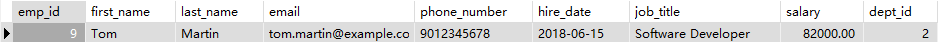

##### 18. 查询每个部门工资最高的员工。

```mysql
WITH rank_employee AS(
	SELECT e.*,dept_name,DENSE_RANK() OVER(
			PARTITION BY e.dept_id
			ORDER BY e.salary DESC
	)AS salary_rank
	FROM employees e
	JOIN departments d ON e.dept_id = d.dept_id
)	
	
SELECT dept_name,CONCAT(first_name," ",last_name) employee
FROM rank_employee re
WHERE re.salary_rank = 1
```


##### 19. 计算每个部门的工资总和,并按照工资总和降序排列。

```mysql
SELECT dept_name,SUM(salary)
FROM departments d
JOIN employees e ON e.dept_id = d.dept_id
GROUP BY d.dept_id
ORDER BY SUM(salary) DESC
```

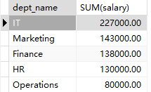

##### 20. 查询员工姓名、部门名称和工资。

```mysql
SELECT CONCAT(first_name," ",last_name) employee_name, dept_name,salary
FROM employees
NATURAL JOIN departments
```


##### 21. 查询每个员工的上级主管(假设emp_id小的是上级)。

```mysql
SELECT CONCAT(e.first_name," ",e.last_name) employee_name,m.manager_name
FROM employees e,(
									SELECT emp_id,dept_id,CONCAT(first_name," ",last_name)AS manager_name
									FROM employees)AS m
WHERE e.dept_id =  m.dept_id AND
			e.emp_id < m.emp_id
```


##### 22. 查询所有员工的工作岗位,不要重复。

```mysql
SELECT CONCAT(first_name," ",last_name) employee_name,job_title
FROM employees
```


##### 23. 查询平均工资最高的部门。

```mysql
WITH departments_salary_rank AS(
	SELECT dept_id,avg_salary,RANK() OVER(
		ORDER BY das.avg_salary DESC
	)AS salary_rank
	FROM (
			SELECT dept_id,AVG(salary) avg_salary
			FROM employees
			GROUP BY dept_id
			)AS das
)
SELECT dept_name,avg_salary
FROM departments_salary_rank dsr
NATURAL JOIN departments
WHERE dsr.salary_rank = 1
```

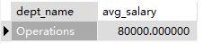

##### 24. 查询工资高于其所在部门平均工资的员工。

```mysql
SELECT CONCAT(first_name," ",last_name) employee_name
FROM employees
JOIN (
		SELECT dept_id,avg(salary) avg_salary
		FROM employees
		GROUP BY dept_id
		)AS departments_avg_salary ON departments_avg_salary.dept_id = employees.dept_id
WHERE salary > avg_salary
```


##### 25. 查询每个部门工资前两名的员工。

```mysql
WITH ranked_employees AS(
		SELECT emp_id,RANK() OVER(
				PARTITION BY dept_id
				ORDER BY salary DESC)AS salary_rank
		FROM employees
)
SELECT CONCAT(first_name," ",last_name) employee_name
FROM ranked_employees AS re
JOIN employees e ON e.emp_id = re.emp_id 
WHERE re.salary_rank = 1
```

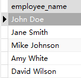

### 学生选课题

##### 1. 查询所有学生的信息。

```mysql
SELECT *
FROM student
```

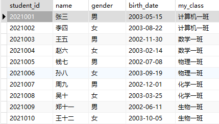

##### 2. 查询所有课程的信息。

```mysql
SELECT *
FROM course
```

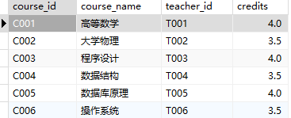

##### 3.查询所有学生的姓名、学号和班级。

```mysql
SELECT name,student_id,my_class
FROM student
```

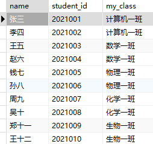

##### 4. 查询所有教师的姓名和职称。

```mysql
SELECT name,title
FROM teacher
```

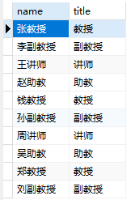

##### 5. 查询不同课程的平均分数。

```mysql
SELECT course_name,avg(score)
FROM course
JOIN score WHERE course.course_id = score.course_id
GROUP BY course.course_id
```

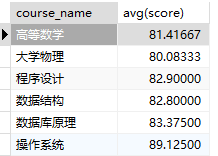

##### 6. 查询每个学生的平均分数。

```mysql
SELECT name,AVG(score)
FROM student
NATURAL JOIN score
GROUP BY student_id
```

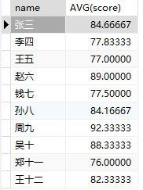

##### 7. 查询分数大于85分的学生学号和课程号。

```mysql
SELECT student_id,course_id
FROM score
WHERE score>85
```

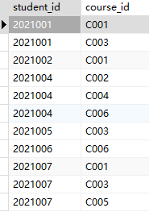

##### 8. 查询每门课程的选课人数。

```mysql
SELECT course_name,COUNT(*)
FROM course
NATURAL JOIN score
GROUP BY course_id
```

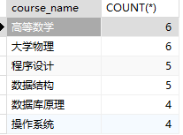

##### 9. 查询选修了"高等数学"课程的学生姓名和分数。

```mysql
SELECT name,score
FROM student
NATURAL JOIN score
NATURAL JOIN course
WHERE course_name = "高等数学"
```

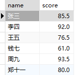

##### 10. 查询没有选修"大学物理"课程的学生姓名。

```mysql
SELECT name
FROM student s1
WHERE s1.name NOT IN(
		SELECT name
		FROM student s2
		NATURAL join score
		NATURAL join course
		WHERE course_name = "大学物理" 
)
```

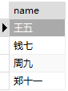

##### 11. 查询C001比C002课程成绩高的学生信息及课程分数。

```mysql
SELECT student.*,c1.C001score ,c2.C002score
FROM student
JOIN (
	SELECT student_id,score C001score
	FROM score
	WHERE score.course_id = 'C001'
) AS C1 ON C1.student_id = student.student_id
JOIN (
	SELECT student_id,score C002score
	FROM score
	WHERE score.course_id = 'C002'
) AS C2 ON C2.student_id = student.student_id
WHERE C1.C001score > C2.C002score
```

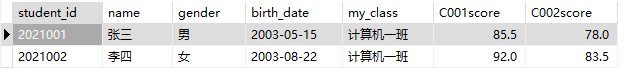

##### 12.统计各科成绩各分数段人数：课程编号，课程名称，[100-85]，[85-70]，[70-60]，[60-0] 及所占百分比

```mysql
SELECT course_id,course_name,
    SUM(CASE WHEN score BETWEEN 85 AND 100 THEN 1 ELSE 0 END) AS score_100_85,
		ROUND(SUM(CASE WHEN score BETWEEN 85 AND 100 THEN 1 ELSE 0 END) / COUNT(*) * 100, 2) AS percent_100_85,
    SUM(CASE WHEN score BETWEEN 70 AND 84 THEN 1 ELSE 0 END) AS score_85_70,
		ROUND(SUM(CASE WHEN score BETWEEN 70 AND 84 THEN 1 ELSE 0 END) / COUNT(*) * 100, 2) AS percent_85_70,
    SUM(CASE WHEN score BETWEEN 60 AND 69 THEN 1 ELSE 0 END) AS score_70_60,
		ROUND(SUM(CASE WHEN score BETWEEN 60 AND 69 THEN 1 ELSE 0 END) / COUNT(*) * 100, 2) AS percent_70_60,
    SUM(CASE WHEN score BETWEEN 0 AND 59 THEN 1 ELSE 0 END) AS score_60_0,
    ROUND(SUM(CASE WHEN score BETWEEN 0 AND 59 THEN 1 ELSE 0 END) / COUNT(*) * 100, 2) AS percent_60_0
FROM score
NATURAL JOIN student
NATURAL JOIN course
GROUP BY course_id
```

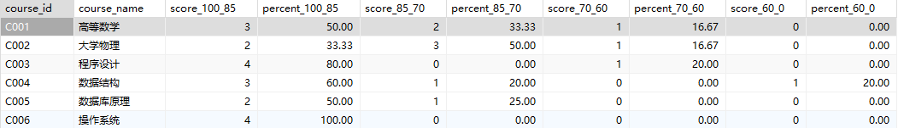

##### 13. 查询选择C002课程但没选择C004课程的成绩情况(不存在时显示为 null )。

```mysql
SELECT student_id,name,score
FROM score
NATURAL JOIN student
WHERE student_id IN(
		SELECT student_id
		FROM score
		WHERE course_id = "C002" AND student_id NOT IN(
				SELECT student_id
				FROM score
				WHERE course_id = "C004"
		)
)
```

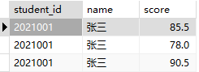

##### 14. 查询平均分数最高的学生姓名和平均分数。

```mysql
WITH ranked_student AS(
		SELECT student_id,avg_score,RANK() OVER(
					ORDER BY avg_score DESC)AS score_rank
		FROM (
					SELECT student_id,AVG(score) AS avg_score
					FROM score
					GROUP BY student_id
					)AS student_avg_score
)
SELECT name,avg_score
FROM ranked_student as rs
NATURAL JOIN student
WHERE rs.score_rank = 1
```

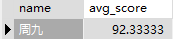

##### 15. 查询总分最高的前三名学生的姓名和总分。

```mysql
WITH ranked_student AS(
		SELECT student_id,total_score,ROW_NUMBER() OVER(
				ORDER BY total_score DESC)AS score_rank
		FROM(SELECT student_id,sum(score)AS total_score FROM score GROUP BY student_id)AS s
)
SELECT name,total_score
FROM ranked_student rs
NATURAL JOIN student
WHERE rs.score_rank <= 3
```

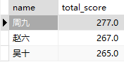

##### 16. 查询各科成绩最高分、最低分和平均分。要求如下：
##### 以如下形式显示：课程 ID，课程 name，最高分，最低分，平均分，及格率，中等率，优良率，优秀率
#####  及格为>=60，中等为：70-80，优良为：80-90，优秀为：>=90
##### 要求输出课程号和选修人数，查询结果按人数降序排列，若人数相同，按课程号升序排列

```mysql
WITH number_course AS (SELECT course_id,COUNT(*) number FROM score GROUP BY course_id)
SELECT course_id,
			course_name,
			number,
			MAX(score) highest_score,
			MIN(score) lowest_score,
			AVG(score) avg_socre,
			round(SUM(case WHEN score>=60 THEN 1 ELSE 0 END)/COUNT(*)*100,2) pass_rate,
			round(SUM(CASE WHEN score BETWEEN 70 AND 79 THEN 1 ELSE 0 END)/COUNT(*)*100,2) medium_rate,
			round(SUM(CASE WHEN score BETWEEN 80 AND 89 THEN 1 ELSE 0 END)/COUNT(*)*100,2) good_rate,
			round(SUM(CASE WHEN score >= 90 THEN 1 ELSE 0 END)/COUNT(*)*100,2) excellent_rate
FROM number_course
NATURAL JOIN score
NATURAL JOIN course
GROUP BY course_id
ORDER BY number DESC,course_id
```

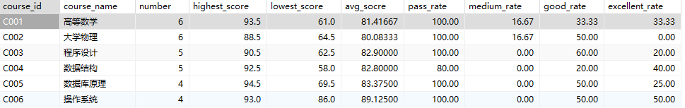

##### 17. 查询男生和女生的人数。

```mysql
SELECT gender,COUNT(*) number
FROM student
GROUP BY gender
```

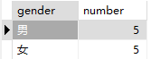

##### 18. 查询年龄最大的学生姓名。

```mysql
WITH ranked_student AS(
		SELECT student_id,name,RANK() OVER(
				ORDER BY birth_date)AS birthday_rank
		FROM student
)
SELECT name
FROM ranked_student rs
WHERE rs.birthday_rank = 1
```


##### 19. 查询年龄最小的教师姓名。

```mysql
WITH ranked_teacher AS(
		SELECT teacher_id,name,RANK() OVER(
				ORDER BY birth_date DESC)AS birthday_rank
		FROM teacher
)
SELECT name
FROM ranked_teacher rt
WHERE rt.birthday_rank = 1
```


##### 20. 查询学过「张教授」授课的同学的信息。

```mysql
SELECT student.*
FROM score
NATURAL JOIN student
NATURAL JOIN course
JOIN teacher t ON t.teacher_id = course.teacher_id 
WHERE t.name = "张教授"
```

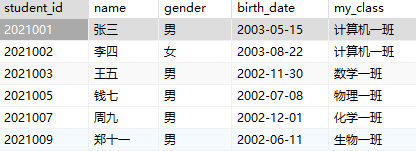

##### 21. 查询查询至少有一门课与学号为"2021001"的同学所学相同的同学的信息 。

```mysql
SELECT student.*
FROM student
NATURAL JOIN score
WHERE course_id IN (
		SELECT course_id
		FROM score
		WHERE student_id = "2021001"
)AND student_id != "2021001"
```

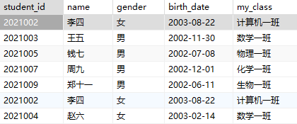

##### 22. 查询每门课程的平均分数，并按平均分数降序排列。

```mysql
SELECT course_name,AVG(score) avg_score
FROM score
NATURAL JOIN course
GROUP BY course_id
ORDER BY AVG(score) DESC
```

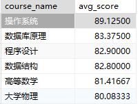

##### 23. 查询学号为"2021001"的学生所有课程的分数。

```mysql
SELECT course_name,score
FROM score
NATURAL JOIN course
NATURAL JOIN student
WHERE student_id = "2021001"
```

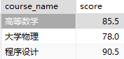

##### 24. 查询所有学生的姓名、选修的课程名称和分数。

```mysql
SELECT name,course_name,score
FROM score
NATURAL JOIN course
NATURAL JOIN student
```

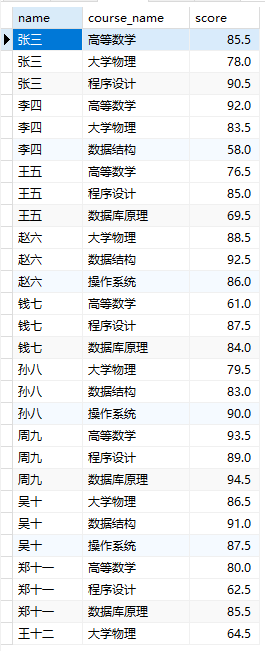

##### 25. 查询每个教师所教授课程的平均分数。

```mysql
SELECT teacher_id,AVG(score) avg_score
FROM score
NATURAL JOIN course
GROUP BY teacher_id
```

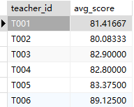

##### 26. 查询分数在80到90之间的学生姓名和课程名称。

```mysql
SELECT name,course_name
FROM student
NATURAL JOIN score
NATURAL JOIN course
WHERE score BETWEEN 80 AND 90
```

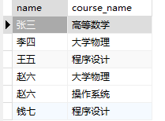

##### 27. 查询每个班级的平均分数。

```mysql
SELECT my_class class,ROUND(AVG(score),2) avg_score
FROM score
NATURAL JOIN student
GROUP BY my_class
```

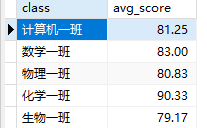

##### 28. 查询没学过"王讲师"老师讲授的任一门课程的学生姓名。

```mysql
SELECT name
FROM student
WHERE student_id NOT IN(
		SELECT student_id
		FROM score
		NATURAL JOIN course
		NATURAL JOIN teacher
		WHERE `name` = "王讲师"
)
```

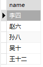

##### 29. 查询两门及其以上小于85分的同学的学号，姓名及其平均成绩 。

```mysql
SELECT student_id,name,AVG(score)
FROM score
NATURAL JOIN student
GROUP BY student_id
HAVING COUNT(CASE WHEN score<85 THEN 1 ELSE 0 END) > 2
```

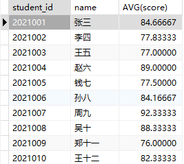

##### 30. 查询所有学生的总分并按降序排列。

```mysql
SELECT student_id,SUM(score) total_score
FROM score
GROUP BY student_id
ORDER BY SUM(score) DESC
```

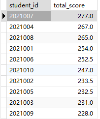

##### 31. 查询平均分数超过85分的课程名称。

```mysql
SELECT course_name
FROM course
NATURAL JOIN score
GROUP BY course_id
HAVING AVG(score)>85
```


##### 32. 查询每个学生的平均成绩排名。

```mysql
WITH ranked_student AS(
		SELECT student_id,RANK() OVER(
				ORDER BY avg_score)AS score_rank
		FROM(SELECT student_id,AVG(score) avg_score FROM score GROUP BY student_id) as s
)
SELECT student_id,score_rank
FROM ranked_student
```

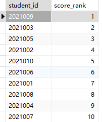

##### 33. 查询每门课程分数最高的学生姓名和分数。

```mysql
WITH ranked_student AS(
		SELECT student_id,course_id,score,RANK() OVER(
				PARTITION BY course_id
				ORDER BY score DESC)AS score_rank
		FROM score
)
SELECT course_name,name,score
FROM ranked_student rs
NATURAL JOIN course
NATURAL JOIN student
WHERE rs.score_rank = 1
```

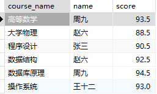

##### 34. 查询选修了"高等数学"和"大学物理"的学生姓名。

```mysql
SELECT `name`
FROM student
NATURAL JOIN score
NATURAL JOIN course
WHERE course_name = "高等数学" AND
			student_id IN (
						SELECT student_id
						FROM student
						NATURAL JOIN score
						NATURAL JOIN course
						WHERE course_name = "大学物理"
)
```

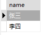

##### 35. 按平均成绩从高到低显示所有学生的所有课程的成绩以及平均成绩（没有选课则为空）。

```mysql
SELECT student_id,course_id,score,AVG(score) course_avg
FROM score
GROUP BY course_id
ORDER BY AVG(score) DESC
```

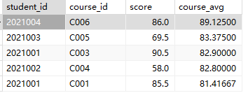

##### 36. 查询分数最高和最低的学生姓名及其分数。

```mysql
WITH ranked_student AS(
		SELECT course_id,student_id,score,RANK() OVER(
				ORDER BY score DESC) AS score_rank_high,
				RANK() over(
				ORDER BY score) AS score_rank_low
		FROM score
)
SELECT name,score
FROM ranked_student rs
NATURAL JOIN student
WHERE rs.score_rank_high = 1 OR rs.score_rank_low = 1
```

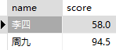

##### 37. 查询每个班级的最高分和最低分。

```mysql
SELECT my_class class,MAX(score) highest_score,MIN(score) lowest_score
FROM score
NATURAL JOIN student
GROUP BY my_class
```

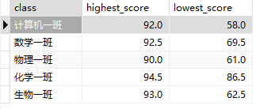

##### 38. 查询每门课程的优秀率（优秀为90分）。

```mysql
SELECT course_id,ROUND(sum(CASE WHEN score>=90 THEN 1 ELSE 0 END)/count(*)*100,2) excellent_rate
FROM score
GROUP BY course_id
```

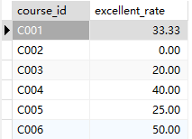

##### 39. 查询平均分数超过班级平均分数的学生。

```mysql
SELECT name,score
FROM student
NATURAL JOIN score
GROUP BY my_class
HAVING score > avg(score)
```


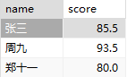

##### 40. 查询每个学生的分数及其与课程平均分的差值。

```mysql
SELECT student_id,s1.course_id,ROUND(score-avg_score,2) diff
FROM score s1
JOIN(
		SELECT course_id,avg(score) avg_score
		FROM score s2
		GROUP BY s2.course_id
)AS course_avg ON course_avg.course_id = s1.course_id
```

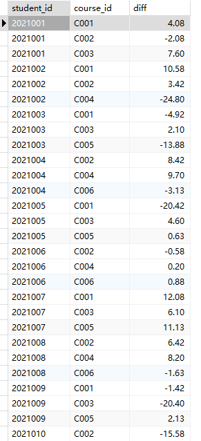
